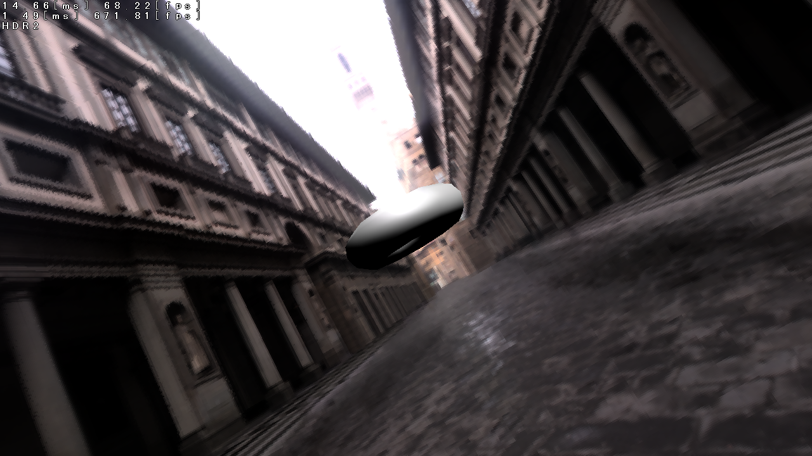
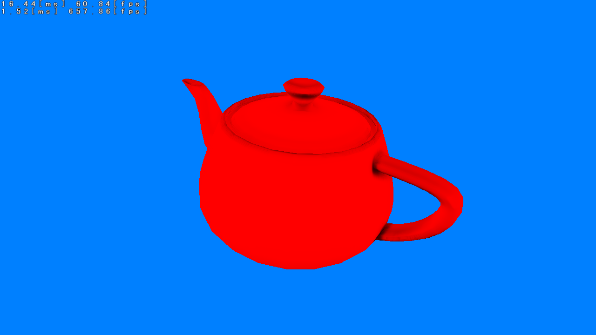
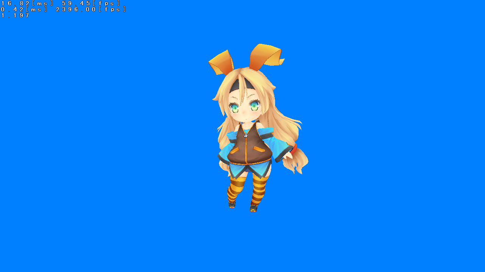

# izanagi

This is library to support to make 3D graphics applications(including games).

## Main Feature

- Multi platfrom support
    - Windows
    - Linux
    - Android
    - Web
    - DirectX 9.0c
    - OpenGL ES2.0
    - OpenGL
-3D graphics system like DirectX9
    - VertexBuffer
    - VertexDeclaration
    - IndexBuffer
    - VertexShdaer
    - PixelShader
    - CubeTexture
- Math library
    - Vector
    - Matrix
    - Quaternion
    - Random number
- 3D skinning model support
    - Simple motion
    - Motion interpolation
    - Motion blend
    - Motion bind to each bone
    - Material
- Font rendering support
    - FreeType
    - Bitmap font
- Threadmodel support
    - JobQueue
    - Parallel
- Touch gesture support
    - Fling
    - Drug
    - Long press
- Simple animation support
    - Interpolation
    - Timeline
    - Story board
- Shader support
    - You can write shader code like fx
    - Simple applying to scene
- PostEffect shader supoort
    - You can write shader code like fx
    - Simple applying to scene
- Gamepad support
    - XInput
- Debug utility
    - Fixed meshes
    - Easy font rendering

# Screeshot

